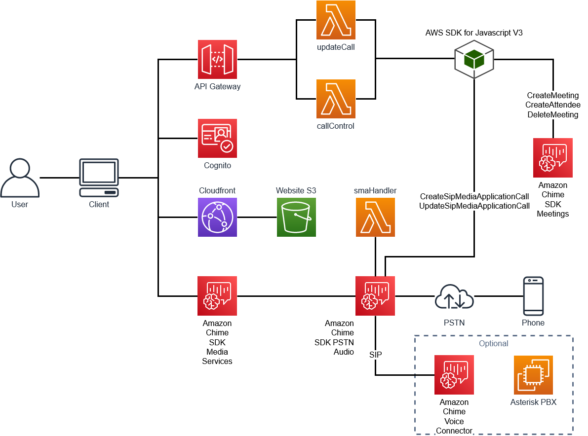

# Amazon Chime Click-To-Call Starter Project

## Overview



This starter project combines three Amazon Chime SDK components to create a demo to connect a customer using Amazon Chime SDK Meetings with an agent using a standard SIP based PBX. Everything required to use this demo is included in the AWS Cloud Development Kit (AWS CDK) deployment.

## Prerequisites

Basic understanding of:

- Amazon Chime SDK Meetings
- Amazon Chime PSTN Audio
- Amazon Chime Voice Connector
- AWS Serverless
- VoIP Telephony

## Components

### Amazon Chime SDK Meetings

This demo uses a simple React based web client to create an Amazon Chime SDK meeting. This client can be found in the [site](site/) directory and will use an Amazon API Gateway with AWS Amplify to make AWS SDK API calls to create the meeting, create attendees, and create the SIP media application call.

### Amazon Chime PSTN Audio

Once the meeting has been created, the AWS Lambda will create an outbound call from the SIP media application to the requested phone number. This SIP media action will control the outbound call and can be enhanced with additional [actions](https://docs.aws.amazon.com/chime/latest/dg/specify-actions.html). For the purpose of this demo, it is simply connecting the Amazon Chime SDK Meeting to a phone number.

### Optional - Amazon Chime Voice Connector

Optionally, you can include a configured Amazon Chime Voice Connector and Asterisk PBX along with an associated phone number. If this phone number is dialed from the React client, a call will be made to the Asterisk PBX where it will be answered and audio echoed back. Alternatively, a phone can be registered to this PBX and used to answer the call.

## How It Works

### Request from Client

[App.js](site/src/App.js):

```javascript
const dialOutResponse = await API.post('callControlAPI', 'dial', {
  body: {
    toNumber: phoneNumber,
  },
});
```

When the Dial button is pressed, a request is made from the client towards the AWS API Gateway with the phone number to dial presented in the `toNumber` field. This request is made using AWS Amplify and configured using the output from the CDK deployment.

[App.js](site/src/App.js):

```javascript
import { AmplifyConfig } from './Config';
import { Amplify, API } from 'aws-amplify';
import { withAuthenticator } from '@aws-amplify/ui-react';
import '@aws-amplify/ui-react/styles.css';

Amplify.configure(AmplifyConfig);
API.configure(AmplifyConfig);
Amplify.Logger.LOG_LEVEL = 'DEBUG';
```

[Config.js](site/src/Config.js):

```javascript
    API: {
        endpoints: [
            {
                name: 'callControlAPI',
                endpoint: configData.APIURL,
                custom_header: async () => {
                    return { Authorization: `${(await Auth.currentSession()).getIdToken().getJwtToken()}` };
                },
            },
            {
                name: 'updateCallAPI',
                endpoint: configData.APIURL,
                custom_header: async () => {
                    return { Authorization: `${(await Auth.currentSession()).getIdToken().getJwtToken()}` };
                },
            },
        ],
    },
```

### Processing on CallControl Lambda

This request will be processed on the CallControl Lambda that is triggered by the API Gateway. After scrubbing the input phone number, the following actions will execute:

- An Amazon Chime SDK Meeting will be created
- Two Attendees will be created in the created meeting
- An outbound call from the meeting using a created `fromNumber` towards the `toNumber` will be started
- This information will be stored in an Amazon DynamoDB table
- The meeting information will be returned to the client

[callControl.js](src/callControl/callControl.js)

```javascript
const joinInfo = await createMeeting();
const dialInfo = await executeDial(joinInfo, toNumber);
await putInfo(joinInfo, dialInfo);
const responseInfo = JSON.stringify({ joinInfo, dialInfo });
response.statusCode = 200;
response.body = responseInfo;
return response;
```

### Response from CallControl Lambda

Once the request has been processed by the CallControl Lambda, the meeting information will be returned to the client. This information will be used to join the client to the Amazon Chime SDK Meeting:

[callControl.js](src/callControl/callControl.js)

```javascript
const joinInfo = {
  meetingInfo: dialOutResponse.data.joinInfo.Meeting,
  attendeeInfo: dialOutResponse.data.joinInfo.Attendee[0],
};
await meetingManager.join(joinInfo);
await meetingManager.start();
```

There is now audio being delivered to and from the client and the Amazon Chime SDK Media services.

This meeting information can be observed from the AWS Command Line Interface (AWS CLI) with:
`aws chime list-meetings`:

```json
{
  "Meetings": [
    {
      "MeetingId": "7e87ac0a-26cd-45a8-aec4-b310b9d50706",
      "ExternalMeetingId": "d3d8f185-d900-411b-9bb7-b5c78c26c6f1",
      "MediaPlacement": {
        "AudioHostUrl": "55f295f786be5af9e69177e8ba3835e0.k.m3.ue1.app.chime.aws:3478",
        "AudioFallbackUrl": "wss://haxrp.m3.ue1.app.chime.aws:443/calls/7e87ac0a-26cd-45a8-aec4-b310b9d50706",
        "ScreenDataUrl": "wss://bitpw.m3.ue1.app.chime.aws:443/v2/screen/7e87ac0a-26cd-45a8-aec4-b310b9d50706",
        "ScreenSharingUrl": "wss://bitpw.m3.ue1.app.chime.aws:443/v2/screen/7e87ac0a-26cd-45a8-aec4-b310b9d50706",
        "ScreenViewingUrl": "wss://bitpw.m3.ue1.app.chime.aws:443/ws/connect?passcode=null&viewer_uuid=null&X-BitHub-Call-Id=7e87ac0a-26cd-45a8-aec4-b310b9d50706",
        "SignalingUrl": "wss://signal.m3.ue1.app.chime.aws/control/7e87ac0a-26cd-45a8-aec4-b310b9d50706",
        "TurnControlUrl": "https://ccp.cp.ue1.app.chime.aws/v2/turn_sessions"
      },
      "MediaRegion": "us-east-1"
    }
  ]
}
```

Additionally, the attendee information can be seen from the AWS CLI with:
`aws chime list-attendees --meeting-id 7e87ac0a-26cd-45a8-aec4-b310b9d50706`

```json
{
  "Attendees": [
    {
      "ExternalUserId": "Phone-User",
      "AttendeeId": "3e8fd1bd-9678-08ba-ae48-ece423260b63",
      "JoinToken": "xxxxxxxxxxxxxxxxxxxxxxxxxxxxxxxxxxxxxxxxxxxxxxxxxxxxxxxxx"
    },
    {
      "ExternalUserId": "Client-User",
      "AttendeeId": "53628c4b-305b-c3a8-6cf2-fd07b03c2ca8",
      "JoinToken": "xxxxxxxxxxxxxxxxxxxxxxxxxxxxxxxxxxxxxxxxxxxxxxxxxxxxxxxxx"
    }
  ]
}
```

### Completion of Outbound Call through Amazon Chime PSTN Audio

In parallel to the response being returned to the client, a call is made through Amazon Chime PSTN Audio. This will cause the SIP media application to invoke the Lambda associcated with the SIP media application with a `NEW_OUTBOUND_CALL`:

[smaHandler.js](src/smaHandler/smaHandler.js)

```
var params = {
  FromPhoneNumber: fromNumber,
  SipMediaApplicationId: smaId,
  ToPhoneNumber: toNumber,
  SipHeaders: {
    'User-to-User': joinInfo.Meeting.MeetingId,
  },
};
console.info('Dial Params: ' + JSON.stringify(params));
try {
  const dialInfo = await chime
    .createSipMediaApplicationCall(params)
    .promise();
```

The call will be sent out from the Amazon Chime PSTN Audio SIP media application from a phone number in the Amazon Chime phone inventory to the configured `toNumber` and the `meetingId` populated in the SIP User-to-User header. See [here](https://docs.aws.amazon.com/chime/latest/dg/sip-headers.html) for more information on using SIP headers with Amazon Chime PSTN Audio. When the called number answers the call, the SIP media application will be invoked with the `CALL_ANSWERED` EventType. After looking up the meeting information in the meetings table in DynamoDB using the TransactionId, the call will be joined to the existing Amazon Chime SDK meeting as the second attendee.

[smaHandler.js](src/smaHandler/smaHandler.js)

```javascript
case 'CALL_ANSWERED':
  console.log('CALL ANSWERED');
  var currentCall = await getCaller(event.CallDetails.TransactionId);
  joinChimeMeeting.Parameters.CallId = event.CallDetails.Participants[0].CallId;
  joinChimeMeeting.Parameters.MeetingId = currentCall.meetingId;
  joinChimeMeeting.Parameters.JoinToken = currentCall.AttendeeInfo[1].JoinToken;
  actions = [joinChimeMeeting];
  break;
```

### Optional - Connecting to a SIP PBX

As part of the deployment, an Asterisk PBX can be created along with an Amazon Chime Voice Connector. If the number dialed from the client is on an Amazon Chime Voice Connector, this call can be delivered with additional information included. In this demo, an Asterisk PBX is optionally deployed to EC2 and configured with an Amazon Chime Voice Connector and associated phone number.

When the call is made from the CallControl Lambda, the meetingId is included in the `User-to-User` SIP header. This header is delivered to the Asterisk PBX and can be seen here (output trimmed for clarity):

<pre>
INVITE sip:+12245554385@XX.XX.XX.XX:5060;transport=UDP SIP/2.0
Record-Route: <sip:3.80.16.122;lr;ftag=rvt4v2gjcp5ag;did=1e41.0531;nat=yes>
Via: SIP/2.0/UDP 3.80.16.122:5060;branch=z9hG4bKfe89.113361e8ae54ec0a2e2aced87cc980ad.0
Via: SIP/2.0/UDP 10.0.160.204;received=10.0.160.204;rport=5060;branch=z9hG4bKpgBcNHF8F9Hrc
From: "" <sip:+12245554410@10.0.160.204:5060>;tag=rvt4v2gjcp5ag
To: <sip:+12245554385@XX.XX.XX.XX:5060>;transport=UDP
Call-ID: 0ca47221-1aa4-4e67-af5a-70ed3222a8fd
Contact: <sip:10.0.160.204:5060;alias=10.0.160.204~5060~1>
X-VoiceConnector-ID: dn0pcxvetmicgerjqmze5c
<mark>User-to-User: f9ca6fe2-19cb-494b-9df7-d90a0c220706</mark>
</pre>

## To Use

##### To Deploy AWS CDK

```
yarn
./deploy.sh
```

This will run a bash script to determine optional context for the deployment.

- If the Asterisk component will be deployed
- The allowed domain name for Amazon Cognito signup. If a domain is entered, only email addresses with the chosen domain will be allowed to register an account with Cognito. If no domain is entered, any email address can be used. Domain should be entered as `example.com`.

Alternatively, these can be entered via directly:
`yarn cdk deploy --context AsteriskDeploy=[y|n] --context AllowedDomain=<DOMAIN_ALLOWED_TO_REGISTER> -O site/src/cdk-outputs.json`

##### To use the client:

```
cd site
yarn
yarn run start
```


This will launch a local client that can be used to place outbound calls. This client uses Amazon Cognito for authentication and will present a Sign In and Create Account dialog box. When using this for the first time, you must create an account with a `Username` of an email address that is part of the domain allowed during the deployment. A confirmation email will be sent to that email address for verification. Once completed, you will be able to use that email address to log in to the client.


##### To connect to the Asterisk server:

```
aws ssm start-session --target INSTANCE_ID
```

### Components Created

- callControl Lambda
- updateCall Lambda
- smaHandler Lambda
- Amazon API Gateway
- DynamoDB Table
- Amazon Chime SIP media application
- Amazon Chime SIP media application rule
- Optional
  - EC2 Instance
    - Public Amazon Virtual Private Cloud (Amazon VPC)
    - Elastic IP
  - Amazon Chime Voice Connector
  - Amazon Chime Phone Number

## To Clean Up

`yarn cdk destroy`

This will remove all created components. Charges can be incurred as part of this demo. To avoid excess charges, please destroy components when you are finished.
